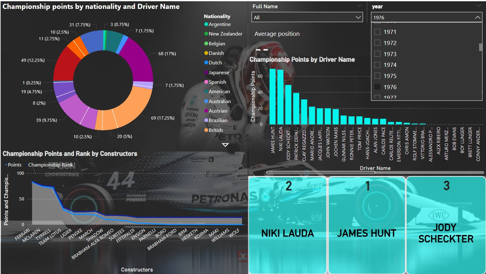

# 🏎️ Datapitstop: Formula 1 Data Engineering Project

This project demonstrates a complete **ETL workflow using Lakehouse Architecture** on Azure. It integrates multiple Azure services to process Formula 1 data, transforming it into meaningful insights through **interactive Power BI dashboards**.

## 📁 Table of Contents
- [📋 Project Overview](#-project-overview)
- [🏗️ Architecture](#️-architecture)
- [⚙️ Key Tools and Technologies](#️-key-tools-and-technologies)
- [🔄 Pipelines and Workflow](#-pipelines-and-workflow)
- [🖼️ Screenshots](#️-screenshots)
  - [📊 Power BI Dashboard Pages](#️-power-bi-dashboard-pages)
- [🎥 Video Presentation](#-video-presentation)
- [📂 Repository Structure](#-repository-structure)
- [📧 Contact](#-contact)

---

## 📋 Project Overview

This project follows the **Lakehouse Architecture** using data from multiple Formula 1 seasons to provide insights into driver and constructor performance. The dataset is sourced from **[Kaggle Formula 1 Data](https://www.kaggle.com/datasets/melissamonfared/formula-1/data)**.

1. **Bronze Layer**: Ingest raw data from **on-premise SQL Server** to Azure Data Lake Gen 2 using **Azure Data Factory (ADF)**.
2. **Silver Layer**: Clean and transform the data using **Azure Databricks** (Apache Spark).
3. **Gold Layer**: Store fully transformed data in **Azure Synapse Analytics** for reporting.

---

## 🏗️ Architecture

### Lakehouse Architecture Workflow
- **Bronze Layer**:  
   - Stores raw, unmodified data for reference and troubleshooting.  
   - Ingests race results, qualifying times, pit stop data, and driver standings via ADF.  
   - **Use Case**: Ensures data reprocessing if transformations fail.

- **Silver Layer**:  
   - Uses **Databricks** to clean, standardize, and enrich the raw data.  
   - Key transformations include:
     - Handling missing values and outliers.
     - Calculating qualifying lap time differences (Q1 to Q3).
     - Integrating driver, constructor, and circuit data for deeper insights.

- **Gold Layer**:  
   - Stores optimized data in **Azure Synapse Analytics** for real-time queries.  
   - Creates views and aggregated tables for Power BI dashboards.

.png)

---

## ⚙️ Key Tools and Technologies

- **Azure Data Factory (ADF)**: Orchestrates pipelines, automating data ingestion and transformation.
- **Azure Databricks**: Processes large datasets using Spark.
- **Azure Synapse Analytics**: Stores curated data for analysis.
- **Azure Data Lake Gen2**: Secure storage for all data layers.
- **Azure Key Vault**: Manages credentials and service principals securely.
- **Power BI**: Creates interactive reports from transformed data.

---

## 🔄 Pipelines and Workflow

1. **Data Ingestion**  
   - **ADF** pipelines load raw data from on-premise SQL Server to ADLS Gen2 (Bronze Layer).
   - Data ingested includes:
     - **Race results**  
     - **Driver and Constructor Standings**  
     - **Qualifying session data**  
     - **Pit stop logs and circuit data**

2. **Data Transformation and Cleaning**  
   - **Databricks** transforms Silver Layer data by:
     - **Standardizing column formats** (dates, time).
     - **Calculating lap time differences** and pit stop efficiency.
     - Creating driver-constructor **performance metrics per circuit**.

3. **Data Aggregation and Curation**  
   - Synapse Analytics aggregates data into **seasonal standings** and **circuit insights** for dashboards:
     - Aggregates **top drivers and constructors per season**.
     - Computes **qualifying vs race performance metrics**.
     - Provides **circuit-level incident insights** and **pit stop efficiency** analysis.

4. **Dashboard Creation and Reporting**  
   - Power BI dashboards connect to Synapse Analytics for **real-time updates**.
   - Automated **ADF workflows** ensure dashboards are always up-to-date.

5. **Security and Integration**  
   - **Service principals** allow secure access between **Databricks** and **Data Lake Gen2**.  
   - **Azure Key Vault** manages credentials to ensure compliance and security.

---

## 🖼️ Screenshots

### Azure Data Factory Pipeline


### Azure Synapse Analytics Pipeline


---

## 📊 Power BI Dashboard Pages
Below are individual pages from the Power BI dashboard, each focusing on specific insights:
---
1. **Driver Championship Overview**

   
---
3. **Constructor Championsip Overview**  

   
---
4. **Circuit Analysis**  

   
---
5. **Pitstop Analysis**  

   
---
6. **Qualifying Overview**  

   

Feel free to explore each page’s specific metrics and KPIs.

---

## 🎥 Video Presentation

Click the image below to view the video

[](https://github.com/dsp196/Datapitstop/raw/refs/heads/main/assets/Updated_dashboard_video%20-%20Made%20with%20Clipchamp.mp4)


## 📂 Repository Structure

```bash
├── images/                     # Architecture and pipeline screenshots
├── notebooks/                  # Databricks notebooks for transformations
├── pipelines/                  # ADF and Synapse pipeline screenshots
├── powerbi/                    # Power BI dashboard images
├── README.md                   # Project documentation
